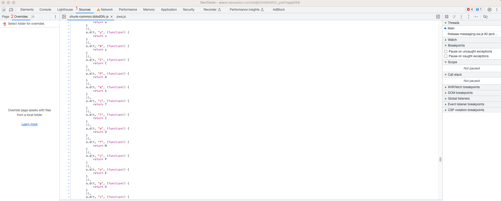
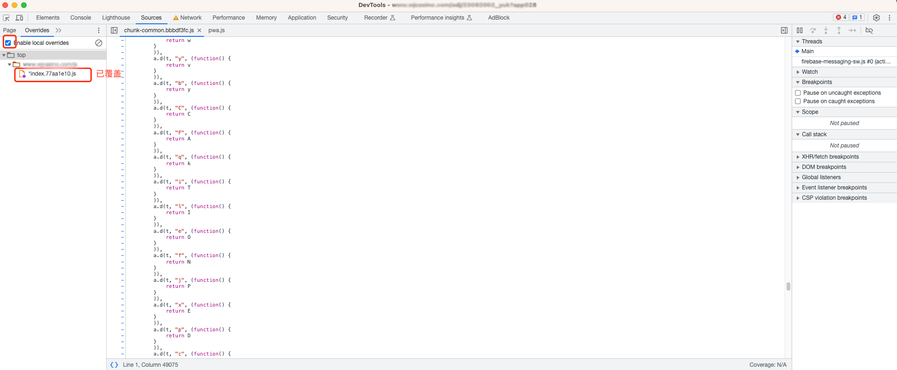

**前言：**
在Web开发过程中，我们常常需要修改文件路径来适应项目的需求。本文将介绍如何使用Dev Tools来修改文件路径，以便更好地管理和调整项目中的文件结构。让我们一起来学习吧！

**步骤一：定位要替换的文件路径**
首先，我们需要找到将要替换的文件路径。假设我们要修改的文件路径是"top/www.xxx.com/js/index.xxx.js"，接下来将会按照这个路径进行操作。

**步骤二：在本地新建一个目录**
为了备份原始文件并进行修改，我们需要在本地新建一个与目标文件路径相同的目录结构。在本例中，我们可以新建一个名为"top/www.xxx.com/js/"的目录。

**步骤三：保存原始文件**
将"index.xxx.js"文件保存到刚刚创建的目录中。这样我们就有了原始文件的备份，可以随时进行修改和恢复。

**步骤四：修改文件放置位置**
现在，我们可以将修改后的文件放置到"top/www.xxx.com/js/"目录中。确保文件命名和格式与原始文件一致。

**步骤五：使用Dev Tools进行文件路径覆盖**
在浏览器中打开开发者工具（Dev Tools），切换到"Sources"（源文件）选项卡。接下来，找到"Overrides"（替换）选项，并启用该功能。

如图所示：

然后，选择要覆盖的文件目录，即"top/www.xxx.com/js/"。通过此操作，我们告诉浏览器在加载页面时将文件从该目录中读取。

**步骤六：刷新页面并验证**
最后，刷新页面。现在，浏览器将使用修改后的文件路径来加载对应文件。通过这种方式，我们成功地覆盖了原始文件，并使修改后的文件生效。

**结语：**
使用Dev Tools修改文件路径是一种灵活且方便的方法，可以帮助我们快速调整项目中的文件结构。通过按照本文提供的步骤进行操作，您可以轻松完成文件路径的修改。希望这篇文章对您有所帮助！

完整的修改文件路径的流程如下：

1. 找到将要替换的文件路径，如"top/www.xxx.com/js/index.xxx.js"。
2. 在本地新建一个目录，按照目标文件路径的结构创建相同的目录结构。
3. 将原始文件保存到新建的目录中。
4. 将修改后的文件放置到目标文件路径的目录中。
5. 使用浏览器的Dev Tools工具，在"Sources"选项卡下的"Overrides"功能中选择要覆盖的文件目录，并启用它。
6. 刷新页面，以便浏览器加载并使用修改后的文件路径。

希望这些步骤可以帮助您成功修改文件路径！如果您有任何疑问，请随时向我提问。祝您操作顺利！